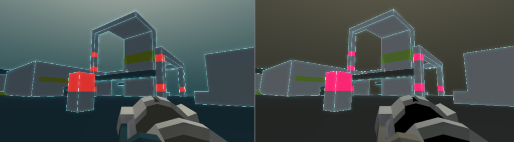

+++
title = "Fabric 2 Nov '18 Devlog: Humble Beginnings"
date = 2018-12-09
+++

So the 7DFPS entry is [there](https://pingfromheaven.itch.io/fabric-2-prototype) and I have a rough idea about what sort of experience I should be going for. Following the jam, I had come up with a short term plan and dived deep into development.

Primary thing that showed itself as a priority during the jam was editing the puzzle structure. I'll probably go deeper into the technical details in another post, but the upshot is that I divide the whole level mesh by a good amount of planes to make bending work. As a result, when I click on a wall with the intention of moving it, for example, I could only select a small part of it. To move it as a whole, I had to select many small meshes, which is super annoying when I'm trying to accomplish something. And these were the small and rather simple levels, from a bend tile count perspective. It would definitely be a big no-no when I come to the big and challenging levels, which would divide the level mesh to tens of subsets. So I went ahead and copied the scene file and did the "compilation" process on that scene copy, leaving the original puzzle scene untouched. Things felt like as they should be, after being done with this.

The later work item of the month was level colors. Now, as a programmer with artistic skills less than a parking meter's, of course I went with minimalism. Because only the thought of opening Photoshop gives me the creeps, let alone coming up with a .png file that could look decent (Fun fact, I didn't even open any image manipulation applications during the Fab2 prototype development), and setting only one color in a material editor feels like something I can actually achieve. There was this reddit post (which I failed to find now) talking about how to make stuff look good without the trained eyes of an artist. The short answer is iteration. Since I can't come up with ideas through my imagination, because I suck at imagnining things, I had to try random things at first, then have an idea about what works and what isn't. To be able to do that, I needed to cut down the iteration time to a minimum.

\[caption id="attachment\_278" align="aligncenter" width="625"\] Can you recognize these color palettes?\[/caption\]

So I wrote down the list of colors that I need in game: 3 colors for the level brushes, bend tiles and end area, a few for the weapon, a couple for skybox. These colors constitute a data structure called a ColorPalette. Then through a small editor script, I assigned the actual material colors from this pre-defined color array. So in the end what I have at hand is a bunch of ColorPalette assets (which are ScriptableObjects), I drag-drop a ColorPalette somewhere and press a button and voilà! The colors of the whole game has changed. In the future, I'll probably bind puzzles to certain ColorPalettes, but that'll come later.

At the moment, I'm at a point where I can create and edit levels rapidly. With this under the belt, the stretch goal is to have around a dozen levels to gauge the wow-ness of the mechanic.

As a bottom note, I've come up with a story draft as well, but that's little more than drunk texting with its current shape. That sort of meta-game stuff is going to be discussed with people anyway, far from being a priority.

In December, there'll be a lot less work done, doubtless, due to the vacations and stuff. But I'll do my best.
