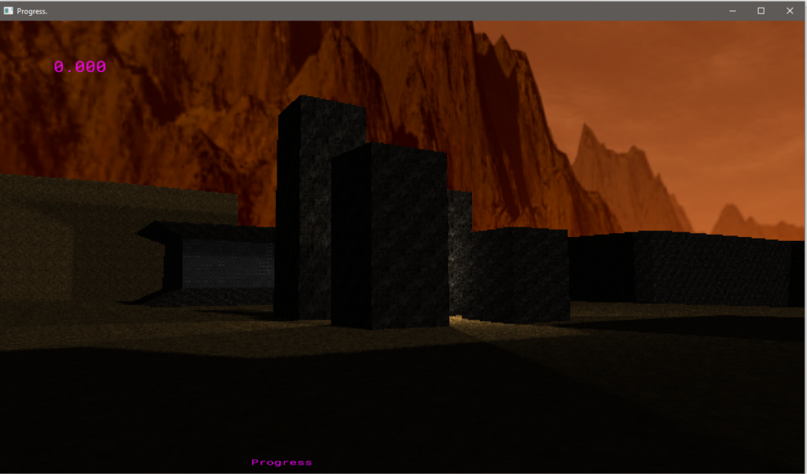

+++
title = "On FPS Game Progress: #2"
date = 2020-07-27
+++

The last a couple of months is spent with laying down the first pieces of the mood by getting some basic visual elements working. Before going into the wall of text, let's start with what we have right now:

{{ youtube(id="NIJNgr9zeXk") }}

What you're looking at mostly is lighting, or more precisely, lackthere of. This particular footage is a bit dark but the game itself is gonna look a lot clearer. There's one directional and a handful point lights in this test scene, along with their shadows. You also can see the PS1-esque wobbly polygons and low-res effect. So let's evaluate the highlights of the work.

# Lighting Is Hard

Certainly, this one is coming as the chief among the other brain-sweat generators. Overall, this topic has been a good re-iteration of what the use of a game engine is. There are a lot of features that we enable with a click of a button in an engine. It's so easy that we totally miss how complicated of a topic that is. Turns out in reality, there's _a LOT_ going on under the hood.

I went with the shadow map technique. There's also this other one [that has a legend's name on it](http://archive.gamedev.net/archive/columns/hardcore/shadowvolume/page2.html), but I found a lot more tutorial material regarding shadow map and I faintly recall implementing a crude one in a university homework. The theory isn't that difficult, to be honest. It boils down to storing somewhere what the light can see, and finding out if a particular point is visible by the light, by checking if that point is obstructed by something when looked at from the light's perspective. Implementation though… It was a different story.

See, after laying the basics down, OpenGL tutorials becomes much easier to follow. There are a lot of great ones, like [Learn OpenGL](https://learnopengl.com/) (this website has become the first suggestion to come up when I press 'L' on the address bar) and [this YouTube playlist](https://www.youtube.com/playlist?list=PLIbUZ3URbL0ESKHrvzXuHjrcLi7gxhBby) which follows that website. The tutorial itself is very explanatory (for a beginner like me) and tutorial code makes a good amount of sense, especially after watching the linked video. You might say "Oh that's nice, I think I understood". You might also say "We even have the code, and this is boilerplate stuff. Let's just put it in the project".  You might even say "Let's have this it's own module or (insert appropriate overengineering term here) so that the code's gonna look nice, right"…

Oh my sweet _sweet_ child.

You know what you got yourself? This:

See that week of empty boxes? That's not a vacation, no. What those boxes don’t show is the amount of random GL calls that you've sprinkled throughout the project. You have, my child, spent hours, every day, staring at an empty screen, trying to debug. Mind you, these are after-a-fulltime-day-job-of-game-development hours.

So the takeaway is, _don't try to make the code look good until it's working,_ unless you absolutely positively 100% know what you're doing. Injecting a lot of GL calls into a slightly structured rendering code path without making it work first, is a sure way to stare at an empty screen (or equivalent) for days.

I mean… _days_:

(Gotta admit though, some of those empty boxes involve World of Warcraft)

Make it work, make it right, make it fast. _In that order._

There's another small take-away I'll just plug in here. After having the shadows in place, I wanted to soften the shadow edges a bit, they looked a bit too sharp that they'd harm the feeling I'm aiming for. Now if I was using Unity (or some other pre-built technology) this piece of work would involve finding the correct button/slider/UI element and poking at it until it yielded the results that I'd find satisfying. If that slider fails you, then you can't go for the exact experience you want. (OK this isn't entirely true, you give asset store a try or go a bit more lower level with your own lighting shaders. But then you'd be setting/adjusting a whole bunch of other stuff that's not really related to soft shadows). I'll also admit that I kind of stole the code took inspiration from the tutorial I've been following, I haven't really come up with the idea of how it works, but since I wrote every line of its code myself, I feel like I have a way higher chance to shape it into the mold until it's exactly as I want it to be.

# Rust

I must admin Rust has provided a pleasant journey so far.  I remember one occasion where the borrow checker actually saved me from another session of empty-screen-debugging. Short version of the story goes like this: I thought "OK these point light objects could share the same shader instance. There's no need to compile it multiple times. Let's just create one instance and pass it along". Rust says "but you can't pass it to more than one light because the shader struct doesn't implement 'copy' trait". I'm like "come on Rust, it's just an integer". Rust is like "[Nope](https://youtu.be/gvdf5n-zI14)". I'm like "fine. Here's your _derive(Copy)_. Are you happy now?" Rust is like "Nope. You decleared a destructor for this shader struct. You can't make that _derive(Copy)_". I went "What? Huh. OK why is this a problem? That destructor deletes the shader progra-- AAAAA. Oh. Okokok. Of course these need to be different instances, are you an idiot? You set positions and stuff for each light." It's a very silly attempt at premature optimization, I admit, but one which would send me into the hole of "Black pixels. Lots of them. Great." nevertheless, had I not writing this thing Rust. So, yeah, thanks borrow checker! (until the time I hate you again)

One thing I've realized though, I've been using a very small subset of Rust so far. For the past few months, I've been lurking in a few Rust-related reddit-discord communities. It seems like the knowledgeable people in the community are pretty nice to newcomers and it's possible to learn stuff while lurking in a passive way. There are questions about some features of Rust that I've only heard about, let alone knowing what sort of problems they're applicable to. People talk about async stuff and dynamic dispatch and tokio and wasm and webgpu some other arcane stuff, I'm like "Yeah I got my little structs here and some functions there and that's it." A few times I put <'a> because, yeah, compiler told me so. I think I'm gonna learn about those when I hit a wall by fighting borrow checker at some point (and be inevitably defeated) and the compiler's gonna send me to my room shouting from behind "AND don't leave there until you figure out how this stuff is supposed to be used! _You hear me young man?!_" and I'll be like "… fine -.- ". I'm expecting that moment to hit any time.

Those communities are amazing by the way. There's all sorts of really cool things people do with Rust, [the gamedev newsletter](https://rust-gamedev.github.io/) being an example. I'm honored that my previous blog post is there in one of the entries, people think my work is worth mentioning for some reason. (Thanks to [Andrey](https://twitter.com/ozkriff?) for his effort to put this stuff together. I know it's not easy) But there's this feeling I can't get rid of: "Dude, I've literally zero idea how people come up with these smarts. This is so beyond me, I don't think I'd ever could wrap my head around this". To the people who look at what I'm doing and think the same: _I have no freaking clue what I'm doing._

Now you might say "Come on, it's not that bad". And you might be right in that. Now this is a good segway to a fitting story I'd like to tell.

# The Clutch Pedal

There's this contrast between the perceived difficulty of the problem and the actual simplicity of it. This concept is in fact the impetus, which helps me when I'm bogged down in the multi-week empty-screen opengl debugging sessions, thinking I'm not smart enough to figure this out. See, we're not writing a research paper here, or solving traveling salesman problem. Being able to render shadows should be the entry level of this sort of problems; it shouldn't require a higher IQ than a highway's speed limit\*. _But then, why is it practically tough to get done?_ When I go into the spiral, usually after 2AM, I always remind myself my younger years when I wasn't able to drive a car. I was working on stepping on the clutch pedal just with the right push so that the car would start moving, but I was failing it almost all the time, stopping it again. It was depressing back in the day (especially when happened in the actual running traffic). I used to see old people driving and think "Man, I'm… It's.. Ugh… _They_ can drive and I _can't_". I knew this was illogical in hindsight, but I couldn't help but feel that way. Now, here's the thought which clicked with me: "Hold on wait a minute. I'm an individual who has the neuromotor abilities to bunny-hop and rocket jump in Quake. And I have a functioning left foot. I _should be_ and _am_ able to do this." This line of thought shifted the focus from the misery of mine sitting in a stationary car in the running traffic, to the actual problem itself, to look at it objectively, as it is. The success rate of starting the car was about the same, but I was no longer in the same state of mind, instead I was like "OK it didn't work, but it'll work next time because I'll do the timing part correct". It… didn't work next time, yeah, but I did the timing better. The number of things I did wrong eventually dwindled_, (here's the important bit)_ through explicitly pointing out what I did wrong and consciously trying to make it right. Time passed, the clutch started behaving, and I felt like "OK I'm ready for this" ~~…and bought a car with automatic transmission but that's not our topic right now.~~ **The point is**, it's easy to feel down when we can't get it right but see others do it, and do it way better, nailing it down. This (and many other negative thoughts with many other reasons to exist) is no piece of cake to get through. This is sort of individual though, I had developed my own ways to cope, starting from [here](https://youtu.be/i7kh8pNRWOo?t=843). In the end I've taught myself to say "OK just shut the hell up and tell me out loud what's exactly wrong here. What do you expect to see, why doesn't it work, at which exact point does it start to go sideways?". Turns out this is a good way of debugging myself when I feel not-so-functioning.

# Unity as a Content Editor

OK let's move on to actual relevant stuff. Now, Unity as a content creation tool (for custom engines) is something I haven't seen before. I had done a ~~slacking off session in gamedev twitter and calling it~~ small field research, and found out that pretty much everybody is using Blender for content creation for 3d games. This probably makes sense, Blender being free and powerful and all that. Although for me, this meant another tool to learn. Mind you, that's gonna be something I'll be forced to do at some point probably, but for now, I actually didn't need it. What I needed is an .obj file that's gonna represent a simple environment to run around and check if lighting works properly. I evaluated my options and the one with the lowest cost presented itself as using Probuilder in Unity. That's something I'm vaguely familiar with and it had a descent obj exporter. And that was enough.

What I need nowadays is just a single model to test the features, but that's gonna change in near future. I'm gonna need to have multiple objects with their positions-rotations, entities like start position and lights. I'm gonna need a bit more structure to make the iteration times faster.

# Next

I'll continue going with setting the mood. I had planned SFX stuff to be in this update, but, I don't know, I've spent enough time here. It's gonna be in the next one. Along with some dynamic lighting and particles. I plan to get rid of test scenes and come up with something that's make you gonna feel something just by walking through. (Because, yeah, there isn't much else to do for the moment)

One thing to be aware of is that the frequency of the work is highly irregular, especially these days. I take a lot of breaks in between the features. If I were you, I wouldn't expect periodic updates.

* * *

I keep talking about the experience and the mood but why don't I still write it down here? So that you'd be able to know what to expect, see if that'd be interesting to you, where this thing is going etc. right? Well, there is the part that goes like "I _would_, if I was able to. This is a form of self-expression that has to be in this interactive medium". While that is true, the reason I don't try to describe it is something else. See, for example, let's say you're listening to an artist that you don't know and _(more importantly)_ anyone didn't tell you what sort of music they make (or you didn't read it anywhere). You, then, tend to listen to the music and sense the feeling that the song tries to get across and nothing else. As soon as you learn about the genre, you make somewhat involuntary judgements about whether or not that song should be something you like. You use your previous knowledge about the genre to load up your prejudice against that immediately. Unintentionally, you try to _compare_ what you're listening to the image of what you think it should sound like. I feel like this kind of skews and pollutes the song's purpose. For example whenever I listen to the Discover Weekly list in Spotify, I prevent myself from looking at the artist's page etc. You might think "What? No, it's stupid" and this might not be the case for everyone; this is highly personal. I intend to leave you alone with the footage (and in the future, the playable), so that what you think this product is, that experience is gonna be yours only.

\*: Not in the US
